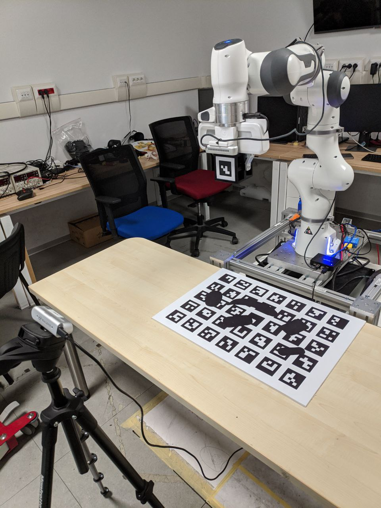

# panda_grasp_server

Simple package to perform basic actions with the robot (i.e. move to a pose, grasp given a target pose, home) within a workbench + table collision avoidance scene. The python node exposes a bunch of services under its namespace. This README specifically refers to using this module in the context of the GRASPA benchmark deployment on the Panda robot. 

Uses messages and services defined in `hsp-panda/panda_ros_common`.

### Requirements

#### Hardware

GRASPA deployment requires 

- a Franka Emika robot arm (firmware version >= 4.0)
- a Franka Hand gripper
- one or more Intel Realsense cameras (mounted on the hand and on the setup)
- Franka Hand mount for the Intel Realsense camera ([Franka camera mount](https://download.franka.de/panda_camera_mount.zip))
- GRASPA layout boards ([printables](https://github.com/hsp-iit/GRASPA-benchmark/tree/master/data/scenes/grasping/printable_layouts))
- GRASPA marker cube for the Franka Hand ([printable cube and markers](https://github.com/hsp-panda/aruco_board_detect/tree/main/assets))
- a workstation where Docker 19.03+ and a Real-Time kernel are installed[1].

[1] a good guide on how to install a RT linux kernel can be found in the official [Franka Control Interface documentation](https://frankaemika.github.io/docs/installation_linux.html#setting-up-the-real-time-kernel).

#### Software

In order to aid with setting up dependencies and configuration, we have provided a [Dockerfile](https://github.com/hsp-panda/dockerfiles-panda/tree/main/ros_panda_setup/ros_panda_setup_graspa). This can be compiled or pulled from this organization directly

`$ docker pull ghcr.io/hsp-panda/ros_panda_setup_graspa:latest`

Together with the dependencies defined in `package.xml`, this package requires the following packages included in this organization:

- [panda_moveit_config](https://github.com/hsp-panda/panda_moveit_config)
- [franka_ros](https://github.com/hsp-panda/franka_ros)
- [panda_ros_common](https://github.com/hsp-panda/panda_ros_common)

To check the dependency status, use `rosdep check panda_grasp_server`.

### Startup

Depending on whether you wish to run the GRASPA reachability/visual calibration procedure or benchmarking grasps, you need to use different launchfiles and configurations. 

#### Reachability/Calibration

1. Set up the hand camera (using the aforementioned mount) and the setup-mounted camera. The latter can be mounted anywhere around the robot, making sure that it won't move and won't be knocked over by the moving robot. Most importantly, both the GRASPA board and the end effector must be in frame at all times during the procedure. 

1. Take note of the serial IDs of the camera.

1. Position the GRASPA board in front of the robot, in the same position used for benchmarking grasps.

1. 3D-print and assemble the [marker cube](https://github.com/hsp-panda/aruco_board_detect/tree/panda_graspa/assets). The edge of the single markers must measure 4 cm, as in the [cfg file](https://github.com/hsp-panda/aruco_board_detect/blob/panda_graspa/aruco_board_detect/cfg/single_markers_config.yaml). Make sure to assemble the cube so that the markers are in the right face and orientation. 

1. Run the pipeline using `GRASPA_reachability_calibration.launch` or [`run_calibration_reachability.sh`](https://github.com/hsp-panda/dockerfiles-panda/blob/main/ros_panda_setup/ros_panda_setup_graspa/run_reachability_calibration.sh), taking care of specifying the required parameters.

1. Follow the instructions that will be shown in the terminal.

1. Output will be found in a directory called `shared` in this repo.

[Procedure_video](https://youtu.be/X-rgVnfvfZc)

#### Benchmarking grasps

1. Set up the hand camera (using the aforementioned mount).

1. Position the GRASPA board in front of the robot, in the same position used for the calibration/reachability procedure.

1. Run the pipeline using `GRASPA_pipeline.launch` or [`run.sh`](https://github.com/hsp-panda/dockerfiles-panda/blob/main/ros_panda_setup/ros_panda_setup_graspa/run.sh), taking care of specifying the required parameters.

1. Send instructions via [ROS services](https://github.com/hsp-panda/panda_ros_common/tree/master/srv) or use one of our [benchmarkable grasp planners](https://github.com/hsp-panda/grasping-benchmarks-panda).

1. Follow the instructions that will be shown in the terminal when it is time to save the grasp.

1. Output will be found in a directory called `shared` in this repo.

[setup photo](assets/setup-objects-board.png)

Expected output:

### Available commands

You can send commands to the module over [ROS services](https://github.com/hsp-panda/panda_ros_common/tree/master/srv). Use the `rosservice [list | info]` command line tool to view them, the names are pretty straightforward. 
