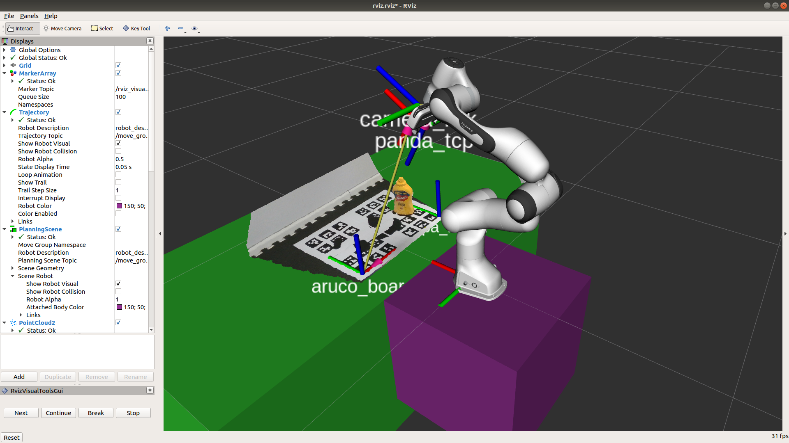

# panda_grasp_server

Simple package to perform basic actions with the robot (i.e. move to a pose, grasp given a target pose, home) within a workbench + table collision avoidance scene. The python node exposes a bunch of services under its namespace.

Uses messages and services defined in `hsp-panda/panda_ros_common`.

### Requirements

Together with the dependencies defined in `package.xml`, this package requires the following packages included in this organization:

- [panda_moveit_config](https://github.com/hsp-panda/panda_moveit_config)
- [franka_ros](https://github.com/hsp-panda/franka_ros)
- [panda_ros_common](https://github.com/hsp-panda/panda_ros_common)

To check the dependency status, use `rosdep check panda_grasp_server`.

### Startup

Use the launch file:

`roslaunch panda_grasp_server grasp_server.launch`

There are additional arguments that you can use:

- `start_realsense:=true` also starts a realsense camera node, if available
- `enable_force_grasp:=true` if using hard Franka fingers, set to `false` if using compliant fingers
- `robot_ip:=<whatever_ip>` if the robot IP is not the default one
- `rviz_config:=<custom_rviz_config_path>` if you want a custom rviz file
- `load_gripper:=false` if you don't need the gripper

Expected output: (you may or may not have the ARUCO board detection set up)


### Startup (simulation - experimental)

> Make sure you installed [easy_panda_sim](https://github.com/hsp-panda/easy_panda_sim)
```
roslaunch easy_panda_sim simulation.launch
roslaunch panda_grasp_server grasp_server_sim.launch
```

### Available commands

You can send commands to the module over ROS services. Use the `rosservice [list | info]` command line tool to view them, the names are pretty straightforward. 

#TODO 
- include default rviz view snapshot
